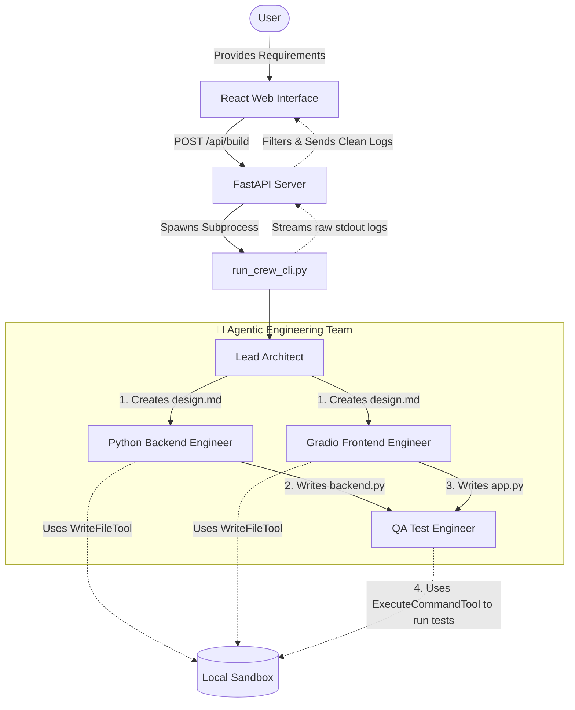

# Agentic Fullstack Builder 🚀

      

Welcome to the **Agentic Fullstack Builder**—an autonomous IDE where you type your requirements and watch AI build your app right before your eyes. 

Powered by **[crewAI](https://crewai.com)**, this project leverages a multi-agent AI system (an "Agentic Engineering Team") to collaboratively design, code, and test complete applications. Unlike standard single-prompt code generators, our system utilizes specialized agents—a Lead Architect, Backend Developer, Frontend Developer, and QA Engineer—working together dynamically in a shared local sandbox to construct robust, runnable software from scratch.

## Installation

Ensure you have Python >=3.10 <3.14 installed on your system. This project uses [UV](https://docs.astral.sh/uv/) for dependency management and package handling, offering a seamless setup and execution experience.

First, if you haven't already, install uv:

```bash
pip install uv
```

Next, navigate to your project directory and install the dependencies:

(Optional) Lock the dependencies and install them by using the CLI command:
```bash
crewai install
```
### Customizing

**Add your `OPENAI_API_KEY` into the `.env` file**

- Modify `src/agentic_fullstack_builder/config/agents.yaml` to define your agents
- Modify `src/agentic_fullstack_builder/config/tasks.yaml` to define your tasks
- Modify `src/agentic_fullstack_builder/crew.py` to add your own logic, tools and specific args
- Modify `src/agentic_fullstack_builder/main.py` to add custom inputs for your agents and tasks

## Running the Project

To kickstart your crew of AI agents and begin task execution, run this from the root folder of your project:

```bash
$ crewai run
```

This command initializes the agentic-fullstack-builder Crew, assembling the agents and assigning them tasks as defined in your configuration.

This example, unmodified, will run the create a `report.md` file with the output of a research on LLMs in the root folder.

## Understanding Your Crew

The agentic-fullstack-builder Crew is composed of multiple AI agents, each with unique roles, goals, and tools. These agents collaborate on a series of tasks, defined in `config/tasks.yaml`, leveraging their collective skills to achieve complex objectives. The `config/agents.yaml` file outlines the capabilities and configurations of each agent in your crew.

## Support

For support, questions, or feedback regarding the AgenticFullstackBuilder Crew or crewAI.
- Visit our [documentation](https://docs.crewai.com)
- Reach out to us through our [GitHub repository](https://github.com/joaomdmoura/crewai)
- [Join our Discord](https://discord.com/invite/X4JWnZnxPb)
- [Chat with our docs](https://chatg.pt/DWjSBZn)

Let's create wonders together with the power and simplicity of crewAI.

## Example Prompts for the Web Builder

You can paste any of the following prompts into the web UI's **Requirements** text box to test the AI engineering team's capabilities:

### Clinic Appointment Management System
```text
A simple appointment management system for a medical clinic.
The system should allow users to book an appointment by providing a patient name, a doctor's name, and a time slot (e.g., "2024-10-15 10:00 AM").
The system should allow users to view all upcoming appointments for a specific doctor.
The system should prevent double-booking a doctor for the same time slot.
The system should allow users to cancel an existing appointment.
The system should include a function to list all doctors available in the clinic.
```

### Expense Splitter (Mini Splitwise)
```text
A simple group expense splitting application.
The system should allow adding new users to a group.
The system should allow a user to add a new expense (e.g., "Dinner"), specifying who paid the total amount, and equally splitting the cost among all users in the group.
The system should maintain a running balance for each user (how much they are owed in total, or how much they owe in total).
The system should provide a summary that lists everyone in the group and their current balance (positive for owed, negative for owes).
```

### Library Book Checkout System
```text
A simple library management system for checking out and returning books.
The system should have a pre-populated list of at least 5 books (title, author, and status: 'available' or 'checked out').
The system should allow a user to search for a book by title or author.
The system should allow a user to check out a book if it is 'available', changing its status to 'checked out'.
The system should prevent a user from checking out a book that is already 'checked out'.
The system should allow a user to return a book, changing its status back to 'available'.
```

### Personal Fitness Tracker
```text
A personal fitness tracking application.
The system should allow a user to log a workout, providing the date, exercise type (e.g., Running, Weightlifting, Yoga), duration in minutes, and calories burned.
The system should allow the user to view a history of all their logged workouts.
The system should calculate and display the total calories burned and total time spent exercising over all time.
The system should be able to filter workouts by exercise type, showing only workouts matching a specific type.
```

---

## 🛠 Technologies & Tools

This project is built on a modern, high-performance stack designed for AI agent orchestration and real-time user interaction:

* **[CrewAI](https://crewai.com/)**: The core framework orchestrating the multi-agent AI engineering team.
* **[FastAPI](https://fastapi.tiangolo.com/)**: A high-performance async Python backend that manages sandbox execution and streams live logs via WebSockets/HTTP streams.
* **[React](https://react.dev/) + [Vite](https://vitejs.dev/)**: The blazing-fast frontend powering the split-pane IDE experience.
* **[Tailwind CSS](https://tailwindcss.com/)**: For beautiful, responsive styling and typography (using the `@tailwindcss/typography` plugin).
* **[Gradio](https://www.gradio.app/)**: The framework our AI agents use to rapidly spin up and serve web interfaces dynamically inside the sandbox.
* **[uv](https://github.com/astral-sh/uv)**: Astral's ultra-fast Python package installer and environment manager, used to run the isolated agent sandbox securely.

---

## 🧠 Agent Architecture

Our system operates using a specialized team of autonomous AI agents working collaboratively in a shared local sandbox. Here is how they interact when you submit a prompt:



### Agent Configuration Code
Agents are defined using YAML and connected to their tools in python. Here is a quick look at how the agents are wired up with our custom file-system tools:

```python
# src/agentic_fullstack_builder/crew.py
from crewai import Agent, Crew, Process, Task
from crewai.project import CrewBase, agent, crew, task
from agentic_fullstack_builder.tools import sandbox_tools

@CrewBase
class EngineeringTeam:
    """The Autonomous Engineering Team"""

    @agent
    def engineering_lead(self) -> Agent:
        return Agent(
            config=self.agents_config['engineering_lead'],
            tools=[sandbox_tools.WriteFileTool(), sandbox_tools.ExecuteCommandTool()],
            verbose=True
        )

    @agent
    def python_backend_engineer(self) -> Agent:
        return Agent(
            config=self.agents_config['python_backend_engineer'],
            tools=[sandbox_tools.WriteFileTool()],
            verbose=True
        )
```
